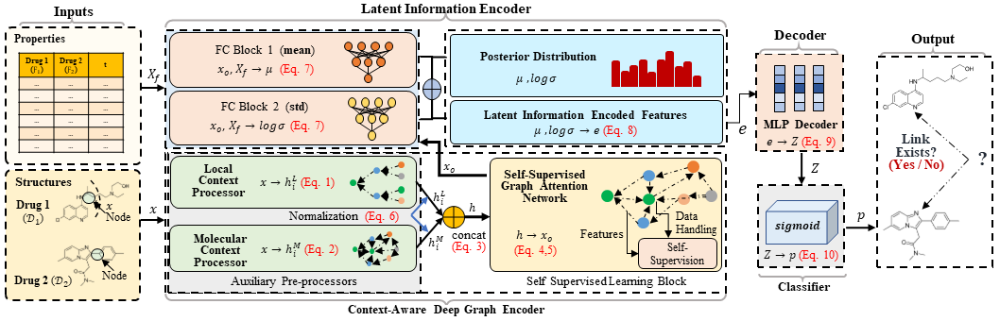

# **CADGL: Context-Aware Deep Graph Learning for Predicting Drug-Drug Interactions**
- Azmine Toushik Wasi, Taki Hasan Rafi,  Raima Islam, Karlo Serbetar and Dong-Kyu Chae
---

## Architecture
 Pipeline of CADGL.

<p align="center">
  
</p>

---

## Setup and run
To install the dependencies run:
```
pip install -r requirements.txt
```
To run the training script, place the dataset from DrugBank, go to `./CADGL/` folder and run:
```
python train.py
```
To change number of epochs, go to `./CADGL/config/config.py` and change the value of the variable `num_total_epoch`. Default is 400. Other settings can be found inside the code.

# Experimental Findings

#### **Possible Novel Drug-Drug Interactions (Not Clinically Verified Yet)**
| No | Drug 1 ($\mathcal{D}_1$) | Drug 2 ($\mathcal{D}_2$) | Interaction Type (t) | Probability|
|---------------|---------------------------|---------------------------|-----------------------|---------------------------| 
| 1             | Secobarbital              | Arotinolol                | Drug 2 hypotensive activities increases ($\uparrow$) | 99.883\%                   |
| 2             | Mesalazine                | Nafamostat                | Drug 2 anticoagulant activities increases ($\uparrow$) | 99.833\%                   |
| 3             | Voriconazole              | Etoposide                 | Drug 2 Serum Concentration increases ($\uparrow$) | 99.816\%                   |
| 4             | Risperidone               | Propofol                  | Risk of adverse effects increases ($\uparrow$) | 99.660\%                   |
| 5             | Pipamperone               | Bupivacaine               | Risk of adverse effects increases ($\uparrow$) | 99.503\%                   |
| 6             | Moricizine                | Hydralazine               | Drug 2 hypotensive activities increases ($\uparrow$) | 99.491\%                   |
| 7             | Isoniazid                 | Tazarotene                | Drug 2 Metabolism decreases ($\downarrow$) | 99.420\%                   |
| 8             | Methylphenobarbital       | Treprostinil              | Drug 2 hypotensive activities increases ($\uparrow$) | 99.366\%                   |
| 9             | Nevirapine                | Vinorelbine               | Drug 2 Serum Concentration decreases ($\downarrow$) | 99.337\%                   |
| 10            | Dabrafenib                | Pentamidine               | Drug 2 QTc-prolongation increases ($\uparrow$) | 98.813\%                   |
| 11            | Acebutolol                | Tramadol                  | Drug 2 therapeutic efficacy decreases ($\downarrow$) | 95.458\%                   |
| 12            | Carvedilol                | Canagliflozin             | Drug 2 hypoglycemic activities increases ($\uparrow$) | 97.283\%                   |
| 13            | Mesalazine                | Nafamostat                | Drug 2 anticoagulant activities increases ($\uparrow$) | 99.833\%                   |
| 14            | Amitriptyline             | Terlipressin              | Drug 2 antihypertensive activities decreases ($\downarrow$) | 98.813\%                   |
| 15            | Ergocalciferol            | Ajmaline                  | Drug 2 arrhythmogenic fixation increases ($\uparrow$) | 79.270\%                   |
| 16            | Darifenacin               | Pentamidine               | Drug 2 hypoglycemic activities increases ($\uparrow$) | 83.362\%                   |
| 17            | Vemurafenib               | Enoxacin                  | Drug 2 serum concentration decreases ($\downarrow$) | 98.806\%                   |
| 18            | Clodronic acid            | Phenprocoumon              | Drug 2 anticoagulant activities increases ($\uparrow$) | 97.729\%                   |
| 19            | Cyclobenzaprine           | Crizotinib                | Drug 2 QTc-prolonging activities increases ($\uparrow$) | 95.635\%                   |
| 20            | Bupranolol                | Penbutolol                | Drug 2 bradycardic activities increases ($\uparrow$)  | 78.210\%  |
